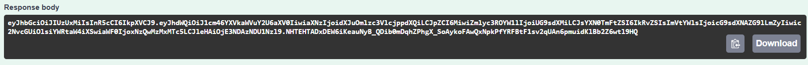
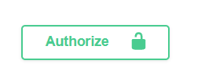
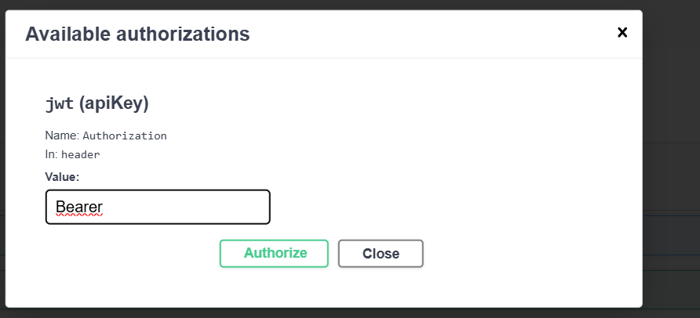

# R6.05 Développement Avancé 
    projet filmothèque
## Sujet 
Sur la base de ce que nous venons de voir. Vous devrez compléter votre application afin de:

Envoyer un mail de bienvenue lorsqu'un utilisateur est créé

Pensez à créer un service dédié a l'envoi de mail

Pensez à utiliser des variables d'environnement pour définir la connexion au serveur de mail

Je vous conseille d'utiliser nodemailer pour envoyer vos mails

Utiliser https://ethereal.email/ afin de tester vos mails

Créer une bibliothèque de films

Un film devra contenir au moins les informations suivantes:

titre

description

date de sortie

réalisateur

Veillez à mettre une validation et des champs en base de données corrects ainsi que les dates de création et modifications en base de données.

Uniquement les utilisateurs admin peuvent créer, modifier et supprimer les films.

Les utilisateurs (scope: user) doivent pouvoir gérer une liste de films favoris (à partir de la liste de films disponibles)

Pensez à générer des messages d'erreurs appropriés si l'utilisateur ajoute un film qu'il a déjà en favoris ou qu'il essaye de supprimer un film qui n'est pas dans ses favoris

Notifications

Lorsqu'un nouveau film est ajouté, nous aimerions pouvoir prévenir les utilisateurs par mail

Lorsqu'un film est modifié, les utilisateurs qui ont le film en favoris doivent être informés par mail.

Message broker

Un endpoint devra permettre à un admin (uniquement) de récupérer un export CSV de l'ensemble des films dans la BDD. Ce fichier ne devra pas être retourné dans la response de la requête HTTP mais via un message broker qui enverra le CSV en pièce jointe par mail à l'utilisateur admin l'ayant demandé.

Bonus : Tests unitaires

Lors de la création de votre projet vous avez dû remarquer la présence du dossier /test. Ajoutez, en utilisant Lab (https://hapi.dev/module/lab/), des tests pour maximiser le code coverage de votre projet. 

## Setup

Pour recuperer et lancer le projet, utiliser les commandes suivantes :
```bash
 git clone https://github.com/PolleEdouard/projetR6.05.git
```
Placer vous à la racine du projet puis executer :
```bash
 npm i 
```
Toujours à la racine avec docker desktop lancé :
```bash
 docker-compose up -d
```
Une fois toutes les dependances installées et le docker lancé le serveur peut être demarrer :
```bash
 npm start 
```
L'applicatrion s'ouvre sur localhost:3000
Lien vers la documentation de l'API -> [API documentation](http://localhost:3000/documentation#/) (avec le serveur lancé !)

Grâce à cette page on va pouvoir utiliser les routes de l'API.

Cependant pour la plupart des routes on doit être connecté.

On commence donc par créer un utilisateur avec la route `POST /user`

Puis se connecter avec `/user/login` cela va générer un token que l'on va copier (voir image ci-dessous)


En haut à droite de la page on retrouve ce bouton 


lorsqu'on clique dessus on a cette interface (le mot bearer est à écrire soit même )
on colle le token à la suite de bearer avec un espace

